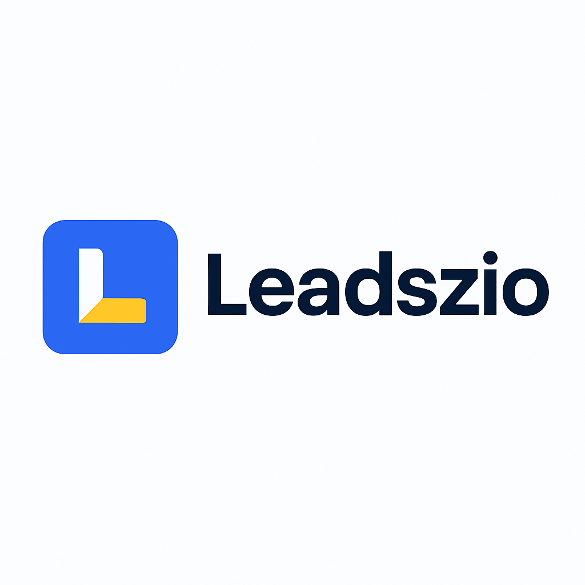

<h1 align="center">
   
  <b>Leadszio</b>
</h1>

  <i>🚀 Your all-in-one B2B Lead Generation & Digital Growth Platform</i>

  
  
  
  

---

## 🧭 Overview

**Leadszio** helps businesses find and connect with potential clients by automating lead generation through social platforms and creating a strong digital presence.

> 💼 From lead acquisition to website development — everything your brand needs to grow, in one place.
---

## ⚙️ Tech Stack

| Category | Technology |
|-----------|-------------|
| Frontend | React.js (Vite / CRA) + Tailwind CSS |
| Backend | Node.js + Express.js |
| Database | MongoDB (Mongoose) |
| Deployment | Netlify (Frontend) / Render (Backend) |
| Other | Axios, Framer Motion, React Router |

---

## 🌟 Key Features

- 🔍 **Smart Lead Finder** – Reach targeted prospects through online platforms  
- 💬 **Integrated Contact System** – Easy communication channels (Email, Telegram, Discord)  
- 💼 **B2B Marketing Tools** – End-to-end branding, website creation & campaign management  
- 📈 **Analytics Ready** – Room for integration with Google Analytics or CRM systems  
- 🧭 **Responsive & Animated UI** – Fully optimized for desktop and mobile  

---
